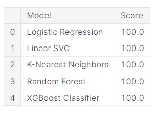
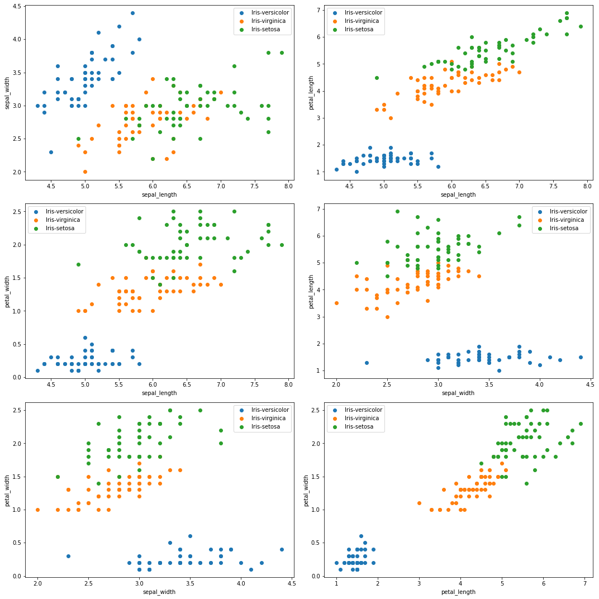

**PROJECT TITLE**

## IRIS Classification

**GOAL**

>Implementtion of different algorithms like random forest, logistic regression, and XGBoost to see which gives better accuracy.

**DATASET**

>Dataset link here: https://archive.ics.uci.edu/ml/datasets/Iris

**DESCRIPTION**

>The main aim of the project is to make a model that helps to class of iris based on the given dataset.

**WORK DONE**

* Analyzed the data and found insights such as correlation, missing values etc.
* Selected the columns that have high correlation than other columns to be used as features. (Refer : `eda-iris-classification.ipynb`)
* Next trained model with algorithms with default parameters:
	* Logistic Regression
	* Linear SVM
	* KNN Classifier
	* Random Forest
	* XGBoost
* We got 100% accuracy on all models.

 
**MODELS USED**

1. Logistic Regression : Logistic regression is easier to implement, interpret, and very efficient to train. It is **very fast at classifying unknown records**.

2. Linear SVM : SVM performs well on classification problems when size of dataset is not too large.

3. KNN Classifier : The KNN algorithm can compete with the most **accurate models because it makes highly accurate predictions**. Therefore, we use the KNN algorithm for applications that require high accuracy but that do not require a human-readable model.

4. Random Forest : It **provides higher accuracy through cross validation**. Random forest classifier will handle the missing values and maintain the accuracy of a large proportion of data. If there are more trees, it won't allow over-fitting trees in the model.

5. XGBoost : XGBoost is **a library for developing fast and high performance gradient boosting tree models**. XGBoost achieves the best performance on a range of difficult machine learning tasks.

6. LightGBM : Light GBM is prefixed as Light because of its high speed. Light GBM can handle the large size of data and takes lower memory to run. it is so popular is because **it focuses on accuracy of results**.

**LIBRARIES NEEDED**

* Numpy
* Pandas
* Matplotlib
* scikit-learn
* xgboost
* seaborn
 

**ANALYSIS**

  

**CONCLUSION**

>We investigated the data, checking for data unbalancing, visualizing the features, and understanding the relationship between different features. We then investigated two predictive models. The data was split into three parts, a train set, a validation set, and a test set. For the first five  base models, we only used the train and test set.

>We achieved 100% accuracy on all models.

**CONTRIBUTION**

>- Created by [Vineeth Reddy](https://linktr.ee/vineethreddy1997)

## Follow me on..
>

